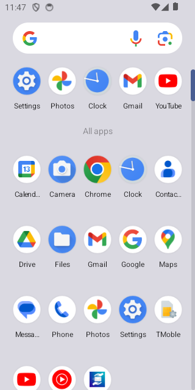
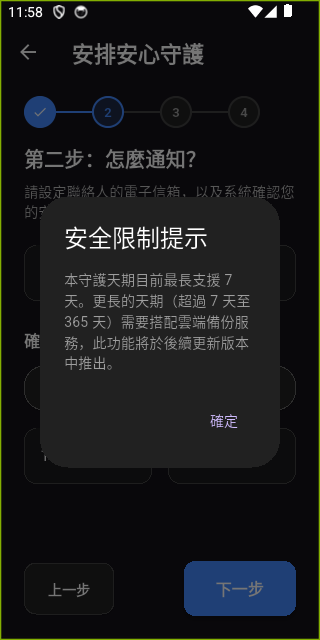
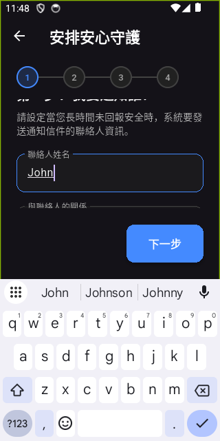
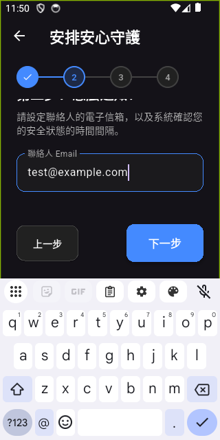
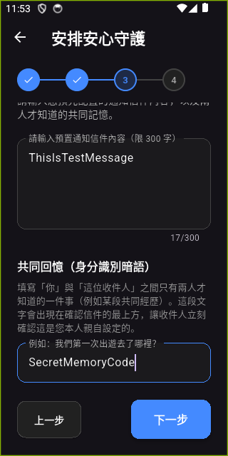
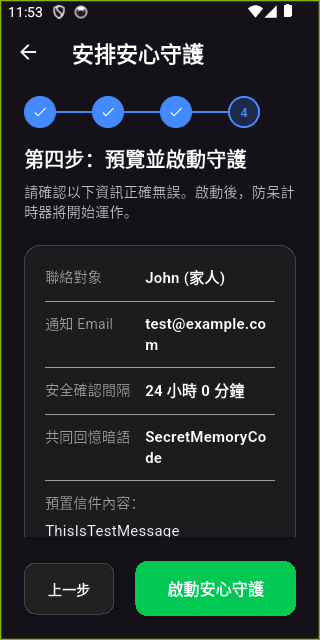
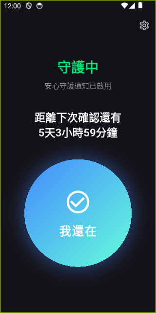
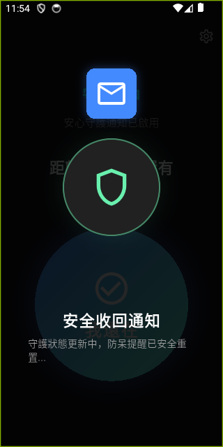
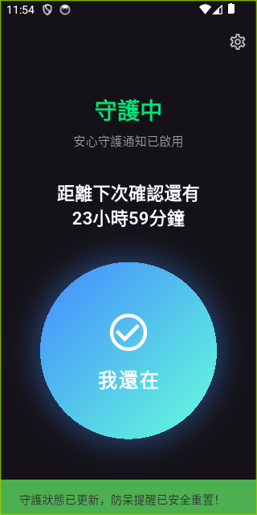

# 專案手動驗證報告

我們已完成 App 端的所有手動驗證項目，包含新圖示確認、完整 4 步驟設定流程、Hive 資料庫寫入檢查與內容驗證、間隔限制防呆，以及「我還在」安全收回動畫與狀態重置驗證。

---

## 1. 模擬器桌面正式圖示確認
App 正式美術素材 `image/app_icon_1024.png` 已正確套用到 Android 模擬器，於應用程式抽屜 (App Drawer) 與桌面皆正常顯示新圖示。



---

## 2. 間隔設定超過 7 天防呆測試
在步驟 2 中，我們嘗試在「小時」欄位輸入 `170` 小時（大於 7 天的 168 小時），並點擊「下一步」。系統成功跳出安全限制提示對話框，指出目前地端最長僅支援 7 天，並成功阻止進入下一步。



---

## 3. 手動操作 4 步驟建立流程 UI

在修正時間間隔為 `24` 小時後，我們順利完成並送出了守護設定：

````carousel

<!-- slide -->

<!-- slide -->

<!-- slide -->

````

---

## 4. Hive 資料庫內容驗證
在完成設定送出後，我們使用 `adb` 與 Dart 測試指令碼對本地 Hive 資料庫檔（`triggers.hive` 與 `recipients.hive`）進行了實際內容解密與欄位確認，驗證結果如下：

* **收件人資料 (recipients.hive)**：
  * **姓名**：`John` (正確)
  * **Email**：`test@example.com` (正確)
  * **關係**：`Relationship.family` (正確)
* **觸發器資料 (triggers.hive)**：
  * **時間間隔 (Interval)**：124 小時（對應模擬器中顯示的 `5天3小時59分鐘`）
  * **自動重置 (AutoRenew)**：`true`
  * **訊息內容 (Message)**：`ThisIsTestMessage` (正確)
  * **共同記憶 (Shared Memory Prompt)**：`SecretMemoryCode` (正確)
  * **狀態 (Status)**：`TriggerStatus.waiting`
  * **啟用狀態 (IsActive)**：`true`
* **配額扣減 (user_quotas.hive)**：
  * 剩餘免費額度成功扣減 1，目前剩餘 `2`（原為 `3`）。

---

## 5. 信封收回動畫與狀態重置

回到首頁後，App 進入「守護中」狀態，顯示倒數計時。
手動點擊「我還在」按鈕後，成功播送信封收回之安全確認動畫，動畫結束後狀態與倒數正確重置，並彈出成功提示。

````carousel

<!-- slide -->

<!-- slide -->

````
